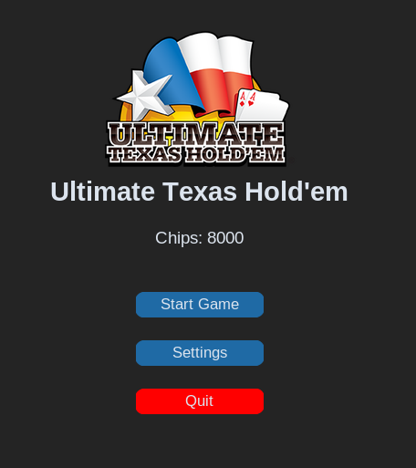
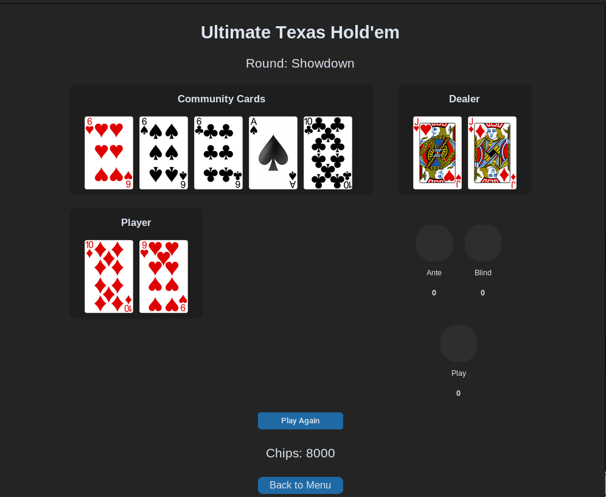

# Ultimate Texas Hold'em

A Python-based Ultimate Texas Hold'em game with a graphical interface built using `customtkinter`. Designed for local single-player gameplay against the dealer.

<p align="center">
  
  
  
  
</p>

## Prerequisites

- Python 3.10 or newer
- Python dependencies:
  - customtkinter
  - Pillow
  - python-dotenv

### Install dependencies:

```bash
pip install customtkinter Pillow python-dotenv
```

## Setup

Run the game from the project's main directory:
```
python main.py
```

## Team
- Dylan Loree
- Aaron Maagdenberg
- Jacob Duncan

## Screenshot Examples

<p align="center">
  
</p>

<p align="center">
  
</p>